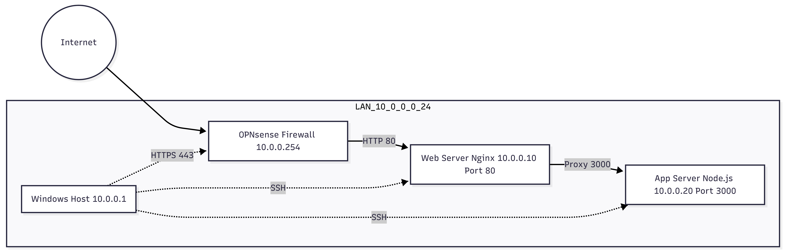

# Secure Server Infrastructure
## OPNsense Firewall, Nginx Reverse Proxy and Node.js Backend

---

# 1. Goal

Build a secure infrastructure with three virtual machines for practical implementation of:

- Linux administration
- Network planning
- Firewall configuration
- Reverse proxy
- systemd services

---

# 2. Network Design



## IP Plan

| System       | Role              | IP Address      |
|--------------|------------------|----------------|
| OPNsense     | Firewall / Router | 10.0.0.254     |
| Web Server   | Reverse Proxy    | 10.0.0.10      |
| App Server   | Backend          | 10.0.0.20      |
| Windows Host | Management       | 10.0.0.1       |

Subnet: 10.0.0.0/24


---

# 3. VM1 – OPNsense

## VM Configuration

- OS: OPNsense (FreeBSD 64-bit)
- CPU: 2 Cores
- RAM: 4 GB
- Disk: 20 GB
- Adapter 1: Bridged (WAN)
- Adapter 2: VMnet1 (LAN)

## Interface

WAN → em0  
LAN → em1  
LAN IP → 10.0.0.254/24

## Firewall

LAN → any → pass

## Quick Test

- https://10.0.0.254 reachable
- WAN receives IP
- Ping to 8.8.8.8 not successful.

Cause: VMware Bridged Adapter was set to "Automatic" and used the wrong network adapter.

Solution: In VMware → Virtual Network Editor → select the correct WLAN/Ethernet adapter for VMnet0.

# 4. VM2 – Web Server (Ubuntu + Nginx)

## VM Configuration

- OS: Ubuntu Server 22.04
- CPU: 2 Cores
- RAM: 2 GB
- Disk: 20 GB
- Network: VMnet1

---

## 4.1 Static IP (Installer during installation)

IPv4 Method: Manual  

- Subnet: 10.0.0.0/24  
- Address: 10.0.0.10  
- Gateway: 10.0.0.254  
- DNS: 1.1.1.1, 8.8.8.8  

After installation, check:

```
ip a
ip route
ping 10.0.0.254
ping 8.8.8.8 (x)
```

### Problem (no Internet)

Ping 8.8.8.8 → 100% packet loss  

Cause: Default gateway not set correctly.

Solution: Edit netplan configuration:


sudo nano /etc/netplan/01-net.yaml


```yaml
network:
  version: 2
  renderer: networkd
  ethernets:
    ens33:
      dhcp4: false
      addresses:
        - 10.0.0.10/24
      gateway4: 10.0.0.254
      nameservers:
        addresses:
          - 1.1.1.1
          - 8.8.8.8
```

```sudo netplan apply```

## 4.2 Nginx

```
sudo apt update
sudo apt install nginx -y
sudo systemctl enable --now nginx
```

---

## 4.3 Reverse Proxy

``` sudo nano /etc/nginx/sites-available/app ```

```nginx
server {
    listen 80;
    location / {
        proxy_pass http://10.0.0.20:3000;
    }
}
```


Enable Site:```sudo ln -s /etc/nginx/sites-available/app /etc/nginx/sites-enabled/```

Remove Default Folder:```sudo rm /etc/nginx/sites-enabled/default```

Test Configuration:```sudo nginx -t```

Restart Nginx:```sudo systemctl restart nginx```

Note: Browser cache may still show the default page. 

Solution: Ctrl + F5 or restart Nginx.


# 5. VM3 – App Server (Node.js)

## VM-Configuration

- OS: Ubuntu Server 22.04
- CPU: 2 Cores
- RAM: 2 GB
- Disk: 20 GB
- Network: VMnet1

---

## 5.1 Static IP (Installer during installation)

IPv4 Method: Manual  

- Subnet: 10.0.0.0/24  
- Address: 10.0.0.20  
- Gateway: 10.0.0.254  
- DNS: 1.1.1.1, 8.8.8.8  

After installation, check:
```ip a
ip route
ping 10.0.0.254
ping 8.8.8.8
```
---

## 5.2 Installation

```
sudo apt update
sudo apt install nodejs npm -y
```

---

## 5.3 Backend

nano server.js

```javascript
const http = require("http");
http.createServer((req, res) => {
  res.end("Hello from Node Server ");
}).listen(3000,"0.0.0.0");
```

---

## 5.4 systemd
Create service file:

sudo nano /etc/systemd/system/app.service


```ini
[Unit]
Description=Node App
After=network.target

[Service]
User=appadmin
WorkingDirectory=/home/appadmin
ExecStart=/usr/bin/node /home/appadmin/server.js
Restart=always

[Install]
WantedBy=multi-user.target
```

```
sudo systemctl daemon-reload
sudo systemcl enable app
sudo systemctl start app
sudo systemctl status app
```

---

## 5.5 UFW

```
sudo ufw allow from 10.0.0.10 to any port 3000
sudo ufw enable
```

---

# 6. Final Test

Backend Direct Test:
curl http://10.0.0.20:3000

Reverse Proxy Test:
curl http://10.0.0.10

Browser Test:
http://10.0.0.10

Result:
Hello from Node Server

---

# 7. Security

- Frontend / Backend Trennung
- Firewall aktiv
- Port 3000 intern geschützt
- Reverse Proxy als Zugriffspunkt
- Dienste persistent über systemd

---

# 8. Conclusion

Basic system integration tasks were planned and successfully implemented.


